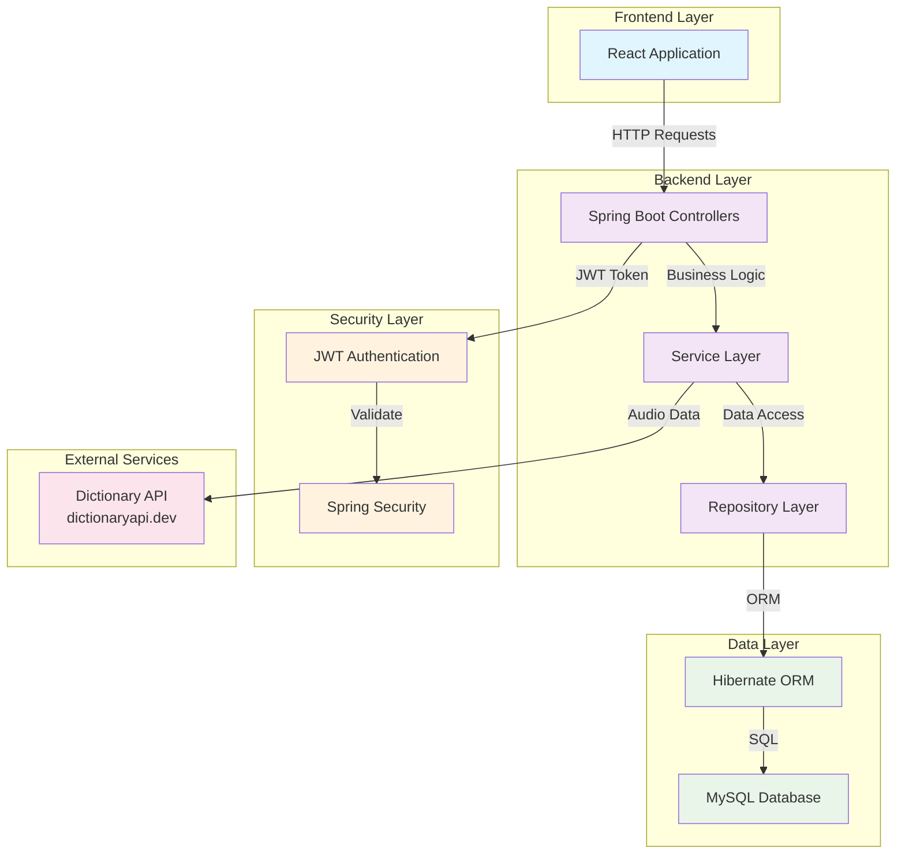
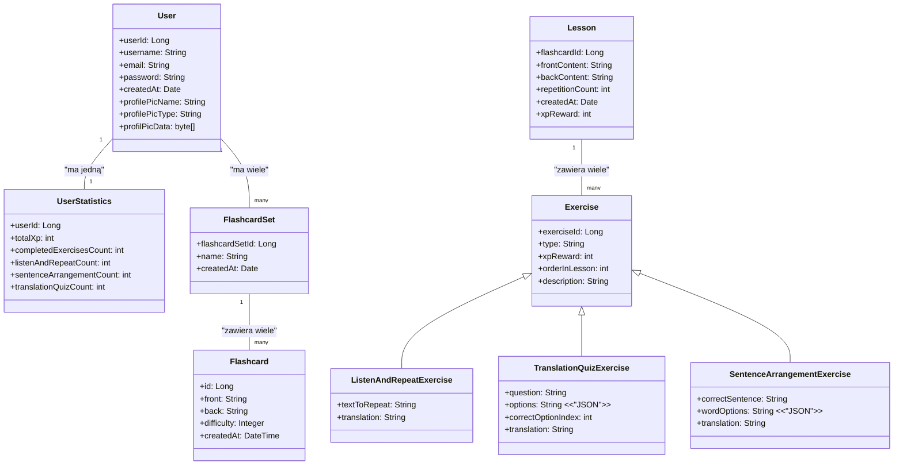

# FluentFlow - Language Self-Study Website

## Overview

FluentFlow is a comprehensive language learning platform designed for self-study, specifically focused on English language learning. The application provides interactive exercises, progress tracking, and gamification elements to enhance the learning experience. Users can practice through various exercise types including listening and pronunciation, sentence arrangement, and translation quizzes, while tracking their progress through statistics and XP-based leaderboards.

## Features

- **User Authentication & Authorization**: Secure registration and login system using Spring Security with JWT tokens
- **Interactive Learning Exercises**:
  - **Listen and Repeat**: Audio-based pronunciation practice with external dictionary API integration
  - **Sentence Arrangement**: Interactive word ordering exercises
  - **Translation Quiz**: Multi-choice translation challenges
- **Progress Tracking**: Comprehensive statistics system tracking completed exercises by category and overall progress
- **Gamification**: XP (Experience Points) system with user rankings and leaderboards
- **User Profile Management**: Customizable profiles with username, email, and profile picture uploads
- **Flashcard System**: Backend support for flashcard sets and individual flashcards (frontend implementation pending)
- **Lesson Organization**: Structured lesson system with multiple exercise types per lesson

## Technology Stack

### Backend
- **Java** - Core programming language
- **Spring Boot** - Application framework
- **Spring Security** - Authentication and authorization
- **Hibernate** - ORM for database operations
- **MySQL** - Primary database
- **JWT** - Token-based authentication
- **Maven** - Dependency management

### Frontend
- **React** - User interface framework
- **JavaScript/TypeScript** - Frontend programming
- **HTML/CSS** - Markup and styling

### External APIs
- **Dictionary API** (https://dictionaryapi.dev/) - Audio pronunciation for listening exercises

## Project Structure

```
Language-self-study-site/
├── backend/
│   └── src/main/java/com/languageselfstudy/
│       ├── config/
│       │   ├── JwtFilter.java
│       │   ├── MapperConfig.java
│       │   ├── SecurityConfig.java
│       │   └── WebConfig.java
│       ├── controller/
│       │   ├── FlashcardController.java
│       │   ├── FlashcardSetController.java
│       │   ├── LessonController.java
│       │   ├── ListenAndRepeatController.java
│       │   ├── SentenceArrangementController.java
│       │   ├── TranslationQuizController.java
│       │   ├── UserController.java
│       │   └── UserStatisticsController.java
│       ├── enums/
│       │   └── ExerciseType.java
│       ├── exceptions/
│       │   ├── EmailAlreadyExistsException.java
│       │   ├── ResourceNotFoundException.java
│       │   ├── UnauthorizedException.java
│       │   └── UsernameAlreadyExistsException.java
│       ├── mappers/
│       │   ├── Mapper.java (interface)
│       │   └── impl/ (mapper implementations)
│       ├── model/
│       │   ├── entities/
│       │   │   ├── Exercise.java
│       │   │   ├── Flashcard.java
│       │   │   ├── FlashcardSet.java
│       │   │   ├── Lesson.java
│       │   │   ├── ListenAndRepeatExercise.java
│       │   │   ├── SentenceArrangementExercise.java
│       │   │   ├── TranslationQuizExercise.java
│       │   │   ├── User.java
│       │   │   ├── UserPrincipal.java
│       │   │   └── UserStatistics.java
│       │   └── dto/
│       │       ├── AuthResponseDto.java
│       │       ├── ExerciseCompletionDto.java
│       │       ├── ExerciseDto.java
│       │       ├── FlashcardDto.java
│       │       ├── FlashcardSetDto.java
│       │       ├── LessonDto.java
│       │       ├── LessonWithExercisesDto.java
│       │       ├── ListenAndRepeatDto.java
│       │       ├── LoginDto.java
│       │       ├── RegisterDto.java
│       │       ├── SentenceArrangementExerciseDto.java
│       │       ├── TranslationQuizExerciseDto.java
│       │       ├── UserDto.java
│       │       ├── UserLeaderboardEntryDto.java
│       │       ├── UserProfilePicDto.java
│       │       ├── UserStatisticsDto.java
│       │       └── XpRequestDto.java
│       ├── repository/
│       │   ├── ExerciseRepository.java
│       │   ├── FlashcardRepository.java
│       │   ├── FlashcardSetRepository.java
│       │   ├── LessonRepository.java
│       │   ├── ListenAndRepeatRepository.java
│       │   ├── SentenceArrangementRepository.java
│       │   ├── TranslationQuizRepository.java
│       │   ├── UserRepository.java
│       │   └── UserStatisticsRepository.java
│       ├── service/
│       │   ├── CustomUserDetailsService.java
│       │   ├── FlashcardService.java
│       │   ├── FlashcardSetService.java
│       │   ├── JwtService.java
│       │   ├── LessonService.java
│       │   ├── ListenAndRepeatService.java
│       │   ├── SentenceArrangementService.java
│       │   ├── TranslationQuizExerciseService.java
│       │   ├── UserService.java
│       │   └── UserStatisticsService.java
│       └── LanguageSelfStudyWebsite.java (Main class)
└── Frontend/
    └── language-self-study-site/ (React application)
```

## Database Entities

### Core Entities

- **User**: User account information, authentication details, and profile data
- **UserStatistics**: Tracks user progress, XP, and exercise completion statistics
- **Lesson**: Container for grouped exercises
- **Exercise**: Base entity for all exercise types (abstract)

### Exercise Types (inherit from Exercise)

- **ListenAndRepeatExercise**: Audio-based pronunciation exercises
- **SentenceArrangementExercise**: Word ordering challenges
- **TranslationQuizExercise**: Translation-based quizzes

### Flashcard System

- **FlashcardSet**: Collections of related flashcards
- **Flashcard**: Individual flashcard entities with front/back content

### Supporting Entities

- **UserPrincipal**: Spring Security UserDetails implementation
- **ExerciseType**: Enumeration defining available exercise categories

## Setup and Installation

### Prerequisites

- Java 17 or higher
- Node.js and npm
- MySQL database
- Maven

### Backend Setup

1. Clone the repository:
```bash
git clone [repository-url]
cd Language-self-study-site/backend
```

2. Configure database connection in `application.properties`:
```properties
spring.application.name=language-self-study
spring.datasource.url=jdbc:mysql://your_database_host:3306/fluentflow
spring.datasource.username=your_username
spring.datasource.password=your_password
spring.datasource.driver-class-name=com.mysql.cj.jdbc.Driver
```

3. Build and run the backend:
```bash
mvn clean install
mvn spring-boot:run
```

The backend will start on `http://localhost:8080`

### Frontend Setup

1. Navigate to frontend directory:
```bash
cd Language-self-study-site/Frontend/language-self-study-site
```

2. Install dependencies:
```bash
npm install
```

3. Start the development server:
```bash
npm start
```

The frontend will start on `http://localhost:3000`

### Database Setup

1. Create a MySQL database named `fluentflow`
2. The application will automatically create tables on first run using Hibernate

## REST API Endpoints

### User Management
- `GET /api/users` - Get all users
- `GET /api/userProfile` - Get current user profile
- `GET /api/userProfilePic` - Get user profile picture
- `POST /api/register` - User registration
- `POST /api/login` - User login
- `GET /api/ranking` - Get user ranking/leaderboard
- `PATCH /api/updateProfilePic` - Update profile picture
- `PATCH /api/updateProfile` - Update user profile

### User Statistics
- `PATCH /api/user-statistics/add-xp` - Add XP to user
- `PATCH /api/user-statistics/update-statistics` - Update user statistics
- `PATCH /api/user-ranking-position` - Update user ranking position

### Lessons
- `GET /api/lessons` - Get all lessons
- `GET /api/lessons/{lessonId}` - Get specific lesson

### Exercises

#### Listen and Repeat
- `GET /api/{lessonId}/listen-and-repeat` - Get listen and repeat exercises for specific lesson

#### Sentence Arrangement
- `GET /api/{lessonId}/sentence-arrangement` - Get sentence arrangement exercises for specific lesson

#### Translation Quiz
- `GET /api/{lessonId}/translation-quiz` - Get translation quiz exercises for specific lesson

### Flashcard Sets (Backend Only)
- `GET /api/flashcard-sets` - Get all flashcard sets for current user
- `GET /api/flashcard-sets/{setId}` - Get specific flashcard set for current user
- `POST /api/flashcard-sets` - Create new flashcard set
- `PUT /api/flashcard-sets/{setId}` - Update flashcard set
- `DELETE /api/flashcard-sets/{setId}` - Delete flashcard set

### Flashcards (Backend Only)
- `GET /api/flashcard-sets/{setId}/flashcards` - Get all flashcards for specific set
- `GET /api/flashcard-sets/{setId}/flashcards/{flashcardId}` - Get specific flashcard
- `POST /api/flashcard-sets/{setId}/flashcards` - Create new flashcard in set
- `PUT /api/flashcard-sets/{setId}/flashcards/{flashcardId}` - Update specific flashcard
- `DELETE /api/flashcard-sets/{setId}/flashcards/{flashcardId}` - Delete specific flashcard

## System Architecture


## Class Diagram


## Notes

- The flashcard functionality is fully implemented in the backend but lacks frontend implementation due to time constraints
- Audio functionality for Listen and Repeat exercises integrates with the Dictionary API for pronunciation
- The application uses JWT tokens for stateless authentication
- All exercise types inherit from the base Exercise entity, enabling polymorphic queries and unified statistics tracking
- User progress and gamification are central features, with XP earning and leaderboard functionality fully implemented
